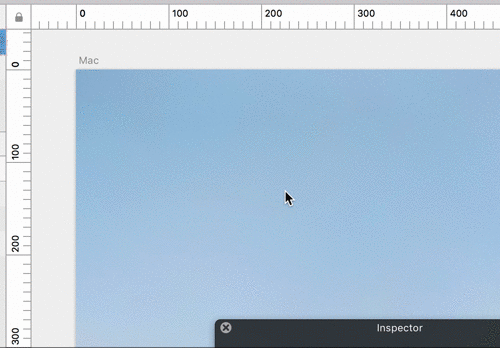

# SketchTurbo
A plugin for Sketch that adjusts scroll speed on a canvas.



# Download

Download SketchTurbo.sketchplugin.zip from [here](https://github.com/usagimaru/SketchTurbo/releases/latest).

# Usage

Install plugin, restart Sketch.app 😀

# Customize

You can change the scrolling coefficient by executing these commands with Terminal.app.

## Trackpad (including Magic Mouse)

Use **`SketchTurbo_TrackPadScrollDelta`**. Default coefficient is `1.5`.

```
$ defaults write com.bohemiancoding.sketch3 SketchTurbo_TrackPadScrollDelta -float 20.0 
```

May be it is very very fast.

## Mouse Wheel

**X-Direction:**

Use **`SketchTurbo_MouseWheelScrollDeltaX`**. Default is `5.0`.

```
$ defaults write com.bohemiancoding.sketch3 SketchTurbo_MouseWheelScrollDeltaX -float 7.0 
```

**Y-Direction:**

Use **`SketchTurbo_MouseWheelScrollDeltaY`**. Default is `6.0`.

```
$ defaults write com.bohemiancoding.sketch3 SketchTurbo_MouseWheelScrollDeltaY -float 8.0 
```

## To reset

Delete them.

```
$ defaults delete com.bohemiancoding.sketch3 SketchTurbo_TrackPadScrollDelta
$ defaults delete com.bohemiancoding.sketch3 SketchTurbo_MouseWheelScrollDeltaX
$ defaults delete com.bohemiancoding.sketch3 SketchTurbo_MouseWheelScrollDeltaY
```

